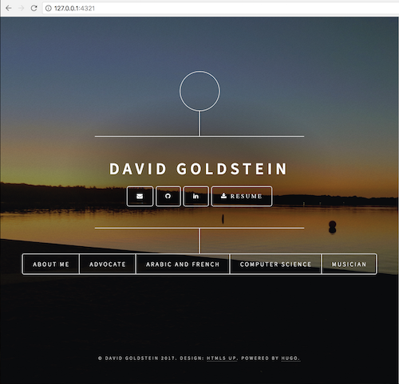

# Davids Website

A personal website telling the world about me, my interests, and career goals. To visit the deployed version, go to www.davidcharlesgoldstein.com.



## Getting Started

The project is built using the R library [blogdown](https://bookdown.org/yihui/blogdown/). It's a simple tool which allows you to serve and deploy sites using [R markdown](http://rmarkdown.rstudio.com/), a language usually meant for displaying graphs and trend analysis, but suprisingly useful for organizing single page applications.

### Prerequisites

1. [Download R Studio](https://www.rstudio.com/products/rstudio/download/). Not a direct dependency, but makes provides a nice interface for installing R and running R commands.

### Installing

```sh
git clone https://github.com/dgoldstein1/DavidsWebsite.git
```

Open up the an R and run the following:

```r
david@david-Oryx-Pro:~/dev/personal/DavidsWebsite$ R

R version 3.4.4 (2018-03-15) -- "Someone to Lean On"
Copyright (C) 2018 The R Foundation for Statistical Computing
Platform: x86_64-pc-linux-gnu (64-bit)

R is free software and comes with ABSOLUTELY NO WARRANTY.
You are welcome to redistribute it under certain conditions.
Type 'license()' or 'licence()' for distribution details.

  Natural language support but running in an English locale

R is a collaborative project with many contributors.
Type 'contributors()' for more information and
'citation()' on how to cite R or R packages in publications.

Type 'demo()' for some demos, 'help()' for on-line help, or
'help.start()' for an HTML browser interface to help.
Type 'q()' to quit R.

> version
               _                           
platform       x86_64-pc-linux-gnu         
arch           x86_64                      
os             linux-gnu                   
system         x86_64, linux-gnu           
status                                     
major          3                           
minor          4.4                         
year           2018                        
month          03                          
day            15                          
svn rev        74408                       
language       R                           
version.string R version 3.4.4 (2018-03-15)
nickname       Someone to Lean On          
> install.packages("blogdown")
Installing package into ‘/home/david/R/x86_64-pc-linux-gnu-library/3.4’
(as ‘lib’ is unspecified)
also installing the dependencies ‘evaluate’, ‘knitr’, ‘rmarkdown’, ‘tinytex’, ‘bookdown’, ‘xfun’, ‘servr’

trying URL 'https://cloud.r-project.org/src/contrib/evaluate_0.14.tar.gz'
Content type 'application/x-gzip' length 24206 bytes (23 KB)
==================================================
downloaded 23 KB
...
> blogdown::install_hugo()
...
> blogdown::serve_site()

                   | EN  
+------------------+----+
  Pages            |  2  
  Paginator pages  |  0  
  Non-page files   |  0  
  Static files     | 41  
  Processed images |  0  
  Aliases          |  0  
  Sitemaps         |  1  
  Cleaned          |  0  

Total in 105 ms
To stop the server, run servr::daemon_stop(1) or restart your R session
Serving the directory /home/david/dev/personal/DavidsWebsite at http://127.0.0.1:4321
```

Open up `http://127.0.0.1:4321` in your browser and you should be taken to the website.

### Website Metrics

This website provides live metrics when the page loads by making requests to get the current user's ip address and then post it to [a backend server I wrote which keeps track of website visits](https://github.com/dgoldstein1/websiteAnalytics-backend). The request javascript code is found in `config.toml` :

```js
// send out requests
  let proxy="https://cors-anywhere.herokuapp.com/"
  let geoIpServer="http://freegeoip.net/json"
  let metricsServer="https://quiet-brushlands-26130.herokuapp.com/visits"
  let localinstance="http://localhost:5000/visits"

  // get IP information and send to analytics database
  $.getJSON(proxy + geoIpServer, function(ipResponse){
    console.log("current ipResponse", ipResponse)
    if (ipResponse) {
      // formulate request to metrics server      
      $.post(metricsServer, JSON.stringify(ipResponse), function(res) {
        console.log("response from db",res)
      })
    }
  });
```

Feel free to change the location of the urls if you want to deploy your own metrics server.

## Deployment

Blogdown generates static html in the `/public` folder and there are multiple ways to deploy this. See [this guide](https://bookdown.org/yihui/blogdown/deployment.html) for more information. Currently, www.davidcharlesgoldstein.com is deployed through [netifly](app.netlify.com). To redeploy, simply merge or push changes to `master.`

## Versioning

We use [SemVer](http://semver.org/) for versioning. For the versions available, see the [tags on this repository](https://github.com/your/project/tags). 

## Authors

* **David Goldstein** - [Decipher Technology Studios](deciphernow.com) - [Personal Website](http://www.davidcharlesgoldstein.com/?github-davids-website)
## License

This project is licensed under the MIT License - see the [LICENSE.md](LICENSE.md) file for details

